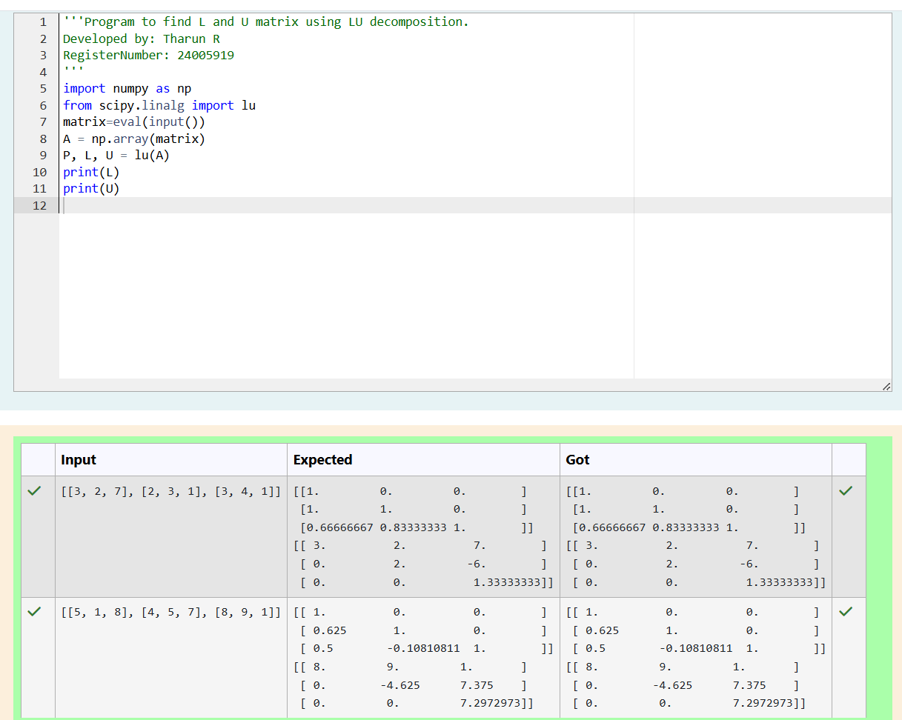
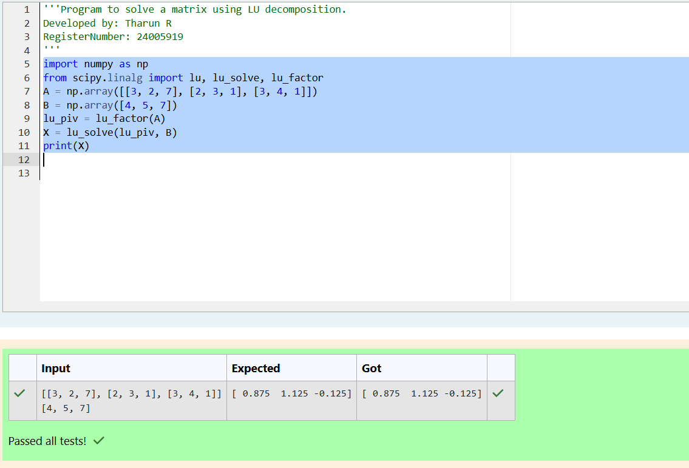

# LU Decomposition 

## AIM:
To write a program to find the LU Decomposition of a matrix.

## Equipments Required:
1. Hardware – PCs
2. Anaconda – Python 3.7 Installation / Moodle-Code Runner

## Algorithm
### i)
#### step1

find the 1 and u matirx by using numpy and linalg from scipy

#### step2

print the 1 matrix and u matirx

#### step3

find the lu decomposition by using numpy and lu_factor and lu_solve

#### step4

print the the following  matrix

### ii)
#### step1

In second program can import lo factor and lu selve from python library as same as in second program.

#### step2

Get the input from user in the form of nested list to compute numpy array format and declare it for both the variables

#### step3

Step Create the variable to Use inputted array to compute of lu, factor of matrix varaible.

#### step4

Step Create the new variable for a solve to compute of x variable and b' variable.

#### step5

Steps Print the corresponding variable (solution) to get the output

## Program:
(i) To find the L and U matrix
```
/*
Program to find the L and U matrix.
Developed by: Tharun R
RegisterNumber: 24005919
*/
import numpy as np
from scipy.linalg import lu
matrix=eval(input())
A = np.array(matrix)
P, L, U = lu(A)
print(L)
print(U)
```
(ii) To find the LU Decomposition of a matrix
```
/*
Program to find the LU Decomposition of a matrix.
Developed by: Tharun R
RegisterNumber: 24005919
*/
import numpy as np
from scipy.linalg import lu, lu_solve, lu_factor
A = np.array([[3, 2, 7], [2, 3, 1], [3, 4, 1]])
B = np.array([4, 5, 7])
lu_piv = lu_factor(A)
X = lu_solve(lu_piv, B)
print(X)

```

## Output:




## Result:
Thus the program to find the LU Decomposition of a matrix is written and verified using python programming.

